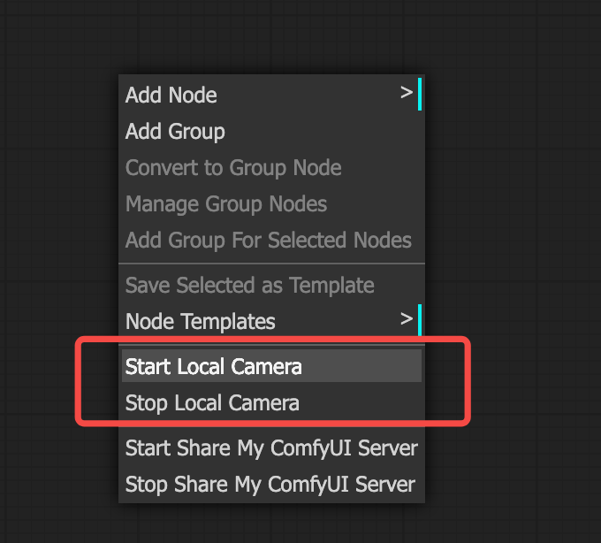
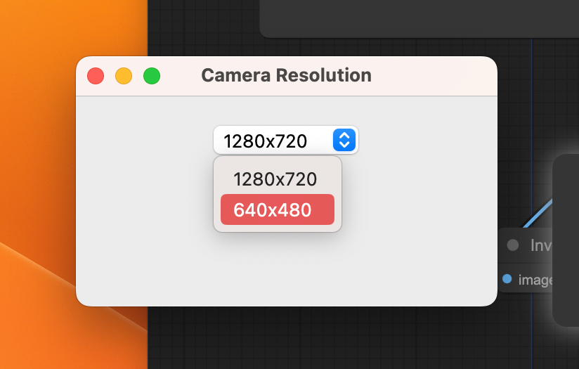
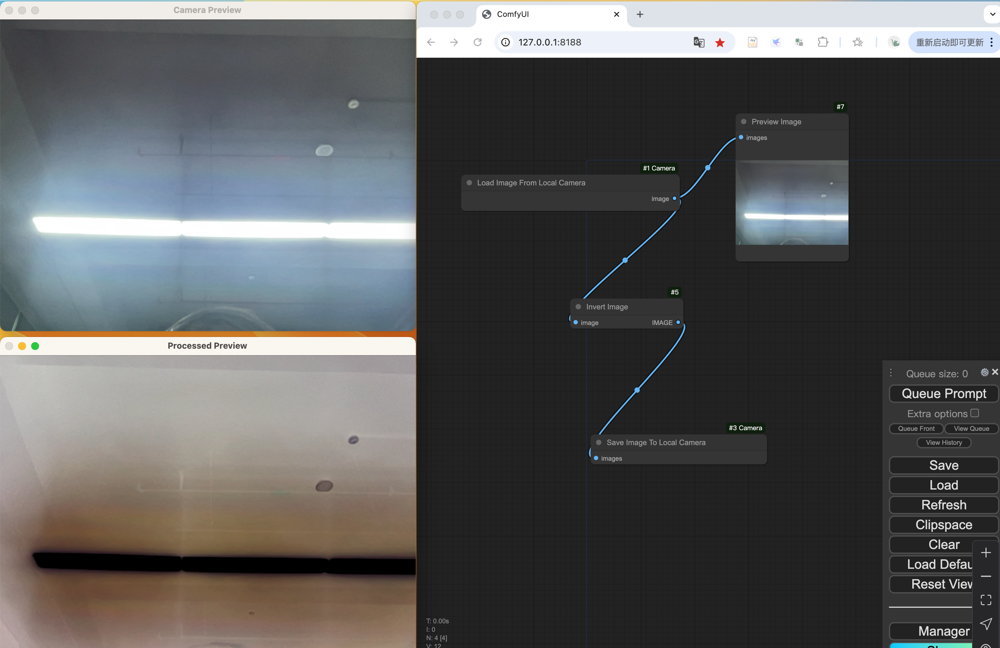
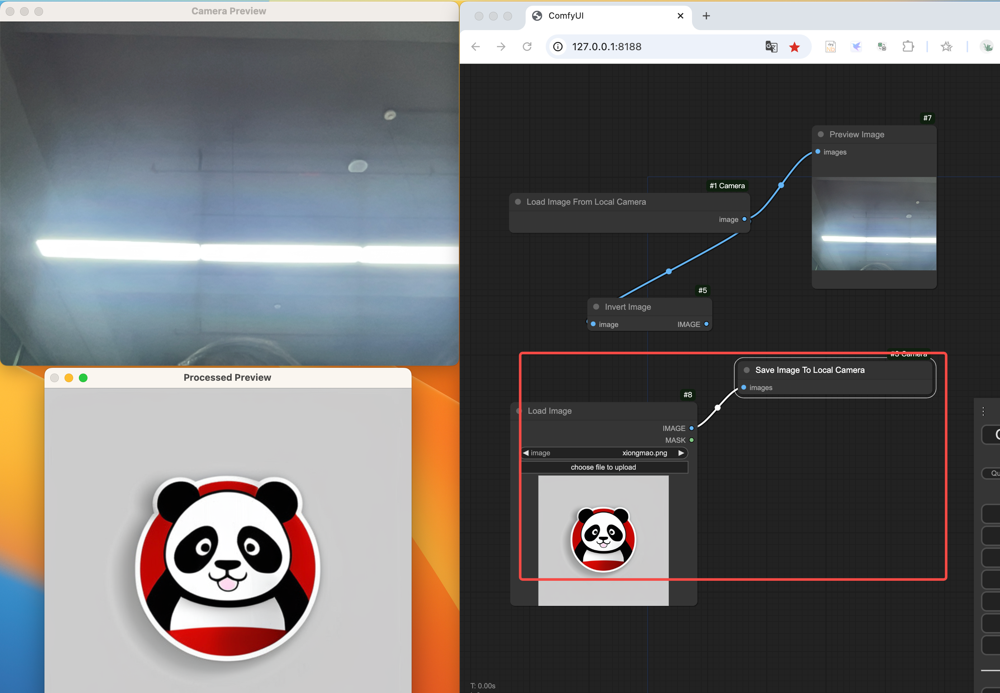
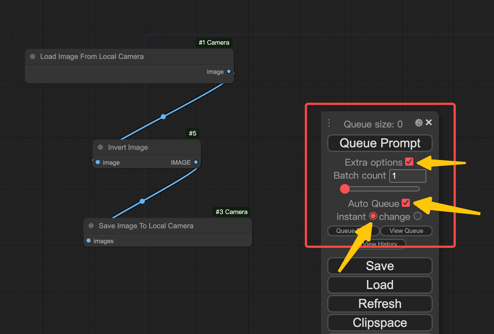

# ComfyUI_Camera

ComfyUI 处理本地实时摄像头，并实时预览结果。

# 简介

1. 通过ComfyUI_Camera插件，你可以在ComfyUI中随时读取本地摄像头帧。
2. 可以高效的预览经过ComfyUI处理后的结果，便于实时处理摄像头帧和实时查看处理的结果。
3. 这一切都可以自己在ComfyUI界面中边一边操作一边实现。

# 使用步骤

1. 安装 `ComfyUI_Camera` 插件。
2. 重启ComfyUI，刷新界面。
3. 右键菜单选择`Start Local Camera`。

4. 等待摄像头启动，选择分辨率。

5. 下载和执行工作流,`real_time_camera_flow.json`

6. 如果需要实时处理，并且实时预览处理结果。按照以下配置，然后执行Queue Prompt，这样就一直执行下去了。

7. 如果你没有物理摄像头，可以使用OBS软件，开启虚拟摄像头进行使用。

8. 右键菜单选择`Stop Local Camera` 来停止摄像头。

# 已验证
## 支持平台
- Windows
- Mac

## 特性
- 处理过程修改分辨率，不用重启。
- 不支持云端部署使用本地摄像头，摄像头和ComfyUI必须在同一台机器上。

